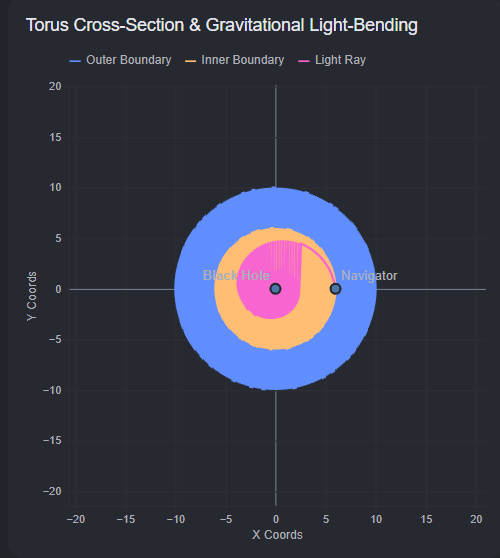

# Том 1. Глава 5. Капкан сингулярности

## Пустота внутри бублика

Автоматическая станция «Торус-12» летела сквозь мрак. Изнутри она напоминала бесконечный круглый коридор, замкнутый сам на себя, — гигантский стальной бублик. Навигатор стоял у внутренней прозрачной стены коридора и смотрел в «дырку» пончика. Там, в самом центре этой космической геометрической фигуры, не было ничего, кроме густой, пугающей черноты.

— Бортовой компьютер, — негромко произнес Навигатор, вглядываясь в бездну. — Я пытаюсь отправить лазерный сигнал на противоположную сторону нашей станции, в модуль обеспечения. Но связи нет. Мой лазерный маркер показывает, что луч просто... исчезает по пути.

Экран навигатора мигнул, и раздался спокойный голос ИИ:
— Мои сенсоры зафиксировали критическую аномалию. В геометрическом центре `(0, 0, 0)` нашего торуса образовался объект с бесконечной плотностью. Черная дыра.

Навигатор почувствовал, как по спине пробежал холодок. 
— Но мы же на безопасном расстоянии? Наш жилой отсек находится на внутренней дуге, радиус трубы защищает нас.

— Верно, — отозвался компьютер. — Конструкция бублика удерживает нас на стабильной орбите. Но пространство внутри «дырки» полностью деформировано. Физика Евклида здесь больше не властна. Это тупик. На языке древних программистов это называлось **Deadlock** — состояние, когда ни один сигнал не может сдвинуться с места, потому что пространство замкнулось в бесконечном ожидании.

---

## Куда исчезает свет?

Навигатор взял ручной лазерный излучатель, закрепил его на штативе и направил строго вдоль горизонтальной плоскости, целясь в блестящий купол жилого модуля на той стороне бублика. Красный луч прорезал туманную дымку пространства, устремился вперед... и вдруг начал плавно, но неотвратимо загибаться к центру. Вместо того чтобы лететь по прямой, свет закрутился в изящную, зловещую спираль и беззвучно исчез в центральной точке.

— Квантовый абсурд... — прошептал Навигатор. — Свет ведь не имеет массы. Как черная дыра может его притягивать?

— Она притягивает не свет, Навигатор, — ответил компьютер, выводя на экран сложную сетку координат. — Она искривляет саму ткань пространства. Прямых линий в этой пустоте больше не существует. Каждый миллиметр пути пространства делает крошечный шаг, наклоняя вектор направления всё ближе и ближе к сингулярности. Куда бы ты ни выстрелил из этой точки, геометрия заставит луч сдаться и упасть в центр.

## Локальный расчет

Навигатор сел за консоль управления. Ему нельзя было тратить энергию на бесконечные случайные выстрелы. Нужно было понять закон, по которому меняется направление луча на каждом микроскопическом отрезке пути.

— Нам не нужна карта всей аномалии, — решительно сказал Навигатор, открывая среду разработки кода. — Мы разобьем путь луча на тысячи крошечных шагов. На каждом шаге наш прибор будет замерять расстояние до центра `(0, 0, 0)` и вычислять, насколько сильно гравитация «потянет» наш вектор направления. Мы заставим алгоритм считать траекторию локально — миллиметр за миллиметром.

— Внимание, — предупредил бортовой ИИ. — Если сила притяжения окажется слишком велика, наш лазерный поток будет навсегда захвачен бесконечным циклом симуляции. Программа зависнет, пытаясь просчитать бесконечность.

Навигатор уверенно положил пальцы на клавиатуру:
— Значит, мы напишем строгий счетчик шагов. Если за пятьсот микрошагов наш луч не пересечет обшивку бублика на другой стороне, компьютер должен признать: это направление ведет «в никуда». Мы найдем безопасную траекторию в обход, используя точные математические типы данных. Время писать код.